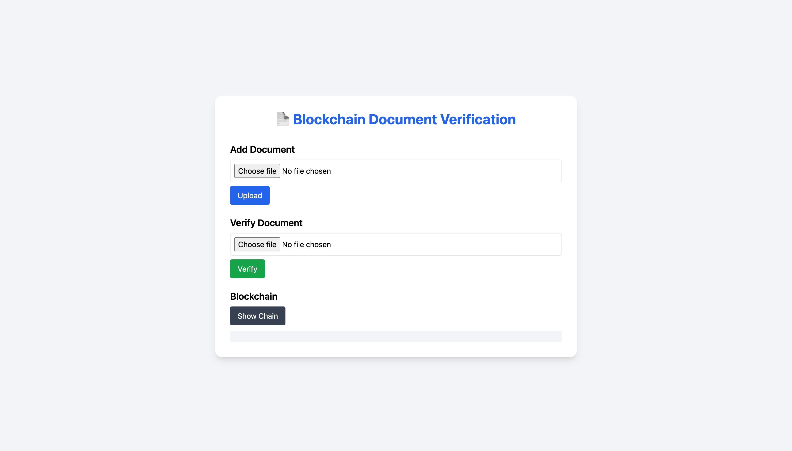

# 📄 Blockchain Document Verification System

A beginner-friendly project that demonstrates how **Blockchain** can be used for **document verification**.  
Built using **Node.js (Express, Multer)** for the backend and **HTML + TailwindCSS** for the frontend.

---

## 🔥 Features

- Upload documents → converted into **SHA-256 hash** and stored in blockchain.
- Verify documents → checks if file already exists in blockchain.
- View entire blockchain in JSON format.
- Secure & tamper-proof document verification.

---

## 📂 Project Structure

document-blockchain-js/
│── blockchain/
│ ├── Block.js # Defines block structure
│ ├── Blockchain.js # Blockchain logic
│
│── utils/
│ ├── fileHash.js # Generates file hash
│
│── public/ # Frontend (UI)
│ ├── index.html
│ ├── style.css
│ ├── script.js
│
│── uploads/ # Temporary file uploads
│── server.js # Express server & APIs
│── package.json
│── README.md

---

## ⚙️ Installation & Setup

1. Clone the repository:
   ```bash
   git clone https://github.com/USERNAME/document-blockchain-js.git
   cd document-blockchain-js
   Install dependencies:
   ```

bash

npm install express multer
Run the server:

bash

node server.js
Open browser and go to:

http://localhost:3000
🖥️ Usage
Add Document
Upload any file.

File is hashed using SHA-256 and added as a new block.

Verify Document
Upload the same file again.

System checks if hash already exists in blockchain.

✅ Verified or ❌ Not Found.

Show Blockchain
Displays all blocks in JSON format.

📷 Screenshots


🚀 Future Improvements
Permanent blockchain storage (JSON/Database).

Better UI with React + Tailwind.

Block visualization instead of plain JSON.

Deploy on cloud (Heroku/Vercel).

👨‍💻 Author
Made with ❤️ by Sameer saifi

```

```
